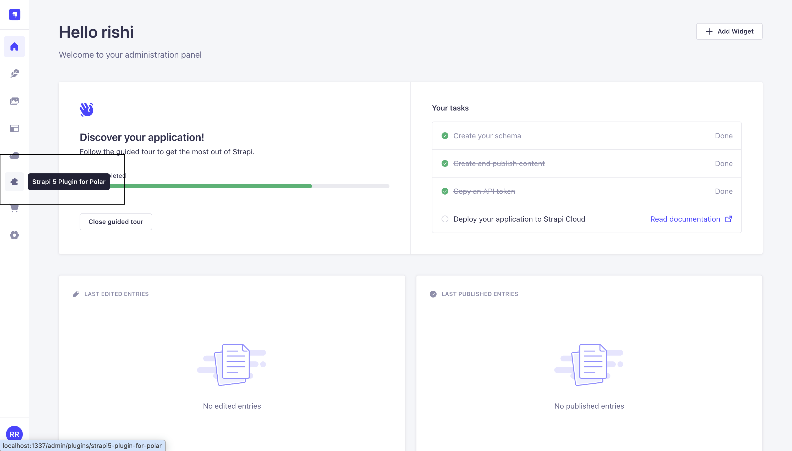
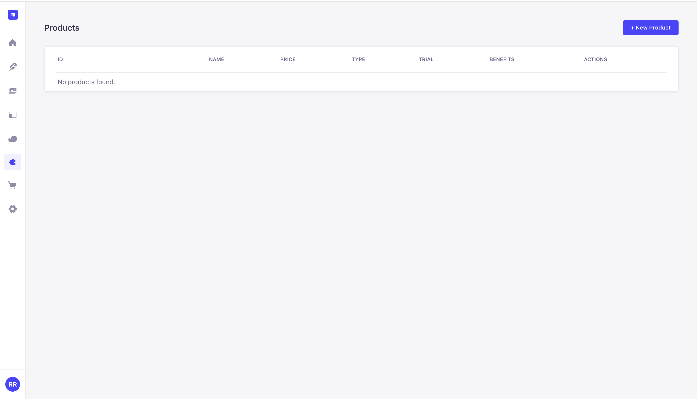
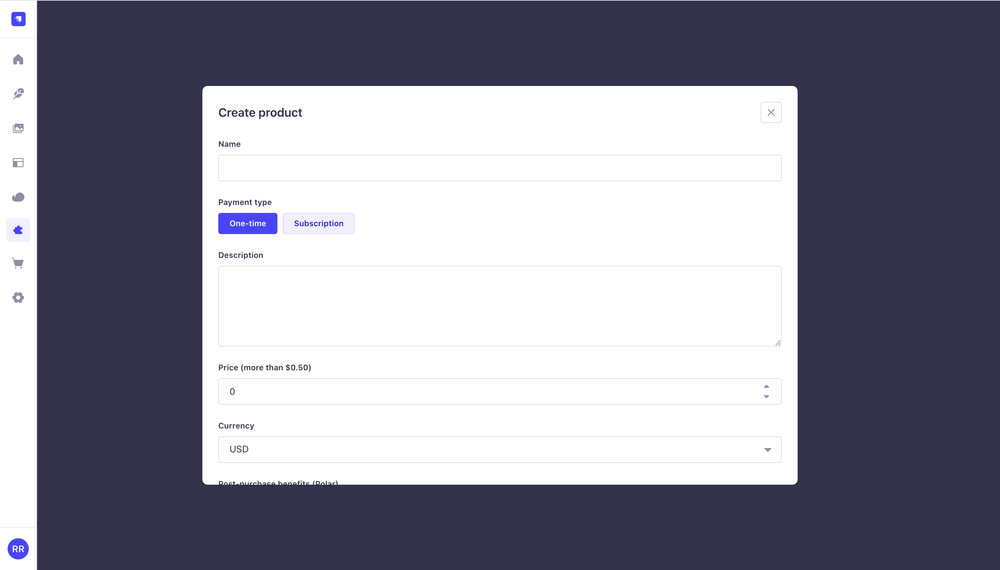
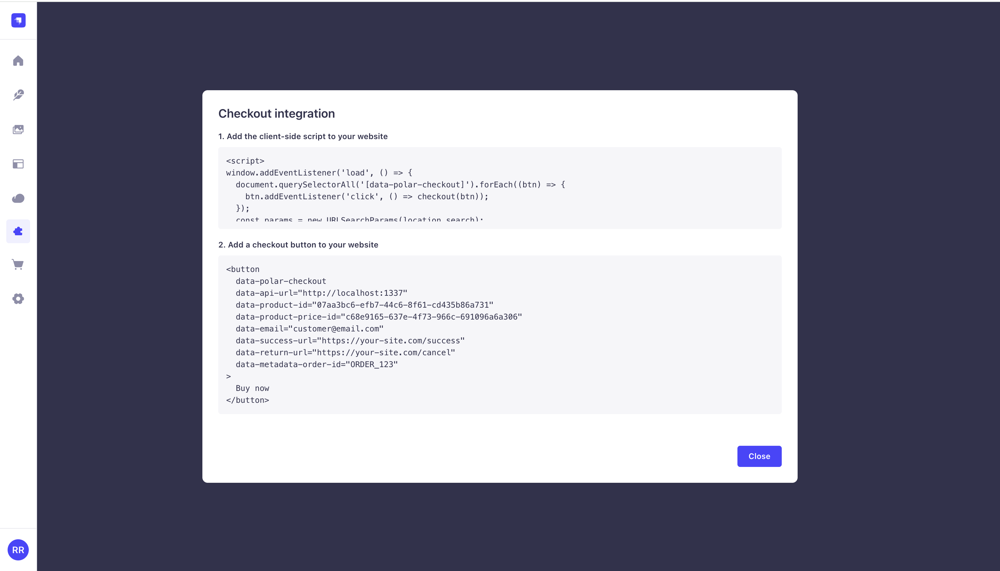
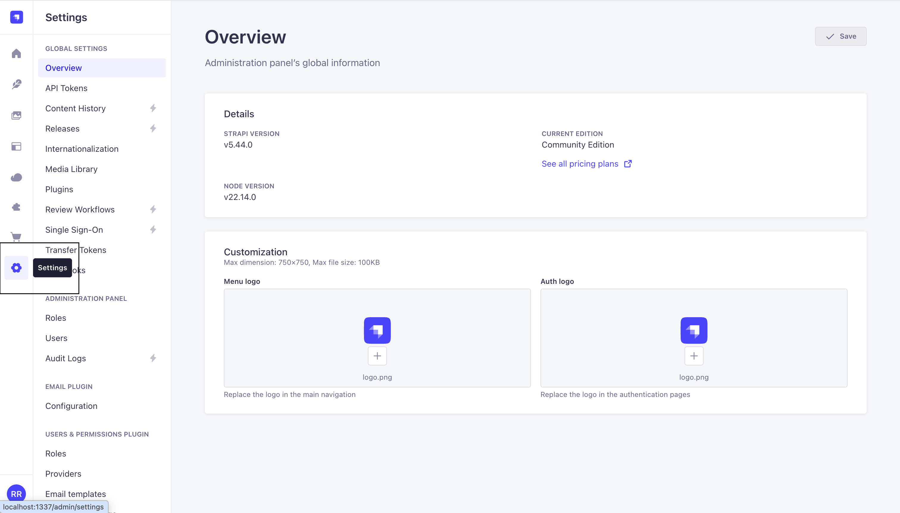
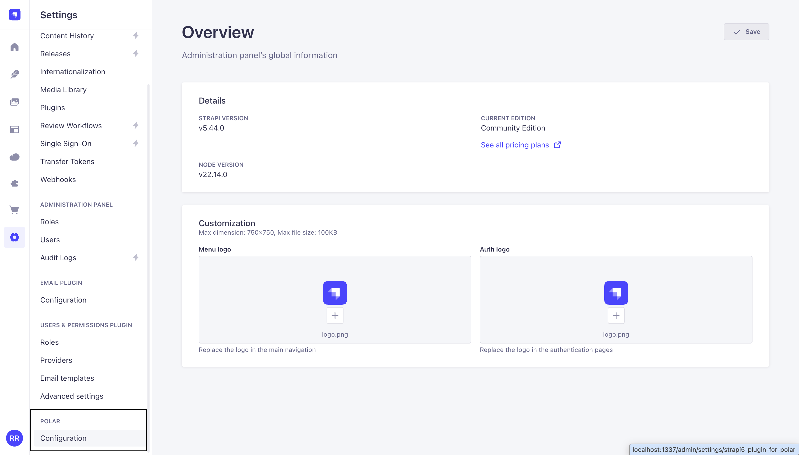
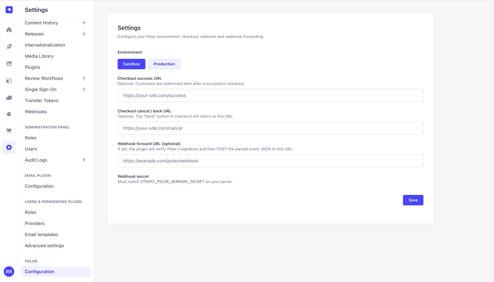

# Get Started with the Polar Plugin for Strapi

If you want to manage both your content and billing in one place, [Polar](https://polar.sh/) is an open-source billing platform that empowers developers to easily monetize their software, while [Strapi](https://strapi.io/) is a leading open-source headless CMS for structuring content and building robust APIs. Together, they give editors an intuitive admin panel and developers complete flexibility and control.

By integrating the [Polar plugin for Strapi](https://github.com/rishi-raj-jain/strapi5-plugin-for-polar), you can manage both your content and your payment configuration directly within the Strapi admin. This keeps everything you need to run your site (content, billing, and checkout) accessible in one place, making setup and ongoing management much simpler.

## Why use Polar with Strapi?

If you already use Strapi to run your site or product, you may want to let users or customers buy plans or sign up for subscriptions without having to layer in a separate tool for payments. By managing payment settings such as pricing, products, and checkout options directly in Strapi (alongside your articles, pages, and other content), you keep things centralized and can streamline updates without duplicating configuration.

In this setup, **Polar** handles billing and checkout, while **Strapi** continues as your main content and operations platform (for content types, management, media, roles, and APIs). The [strapi5-plugin-for-polar](https://www.npmjs.com/package/strapi5-plugin-for-polar) plugin adds a Strapi 5 admin integration so you can manage Polar products and settings directly from the sidebar and the **Settings** section in the Strapi dashboard. Checkout flows for your Polar products run through [Strapi’s content API](https://docs.strapi.io/cms/api/content-api), ensuring that secret keys and tokens remain secure on the server side.

## Who this is for

| Audience | What you get from this path |
| -------- | ---------------------------- |
| **Developers** | One Strapi app: model content as usual, install this package, set `.env`, run `develop`. Polar UI sits beside **Content Manager**; verified webhooks can **forward** to your own HTTP endpoints. |
| **Content & marketing teams** | Fewer tools to learn to start selling i.e. no need to bounce to a separate billing dashboard for every title, description or a price change |
| **Solopreneurs & agencies** | Faster **client onboarding** i.e. you can train editors on Strapi’s plugins, and can flip **sandbox → production** when the client is ready, point [webhook forwarding](https://github.com/rishi-raj-jain/strapi5-plugin-for-polar#-2-create-a-webhook-in-polar-get-the-signing-secret) at the client’s domain or internal API. |

## Create a Strapi project

Let’s get started by creating a new Strapi project. Open your terminal and run the following command:

```bash
npx create-strapi@latest my-strapi-app
```

Complete the CLI prompts (database, TypeScript, etc.) as you prefer.

Once that is done, move into the project directory and start the app in development mode by executing the following command:

```bash
cd my-strapi-app
npm run develop
```

The Strapi admin panel should now be available at http://localhost:1337/admin. Complete the initial registration process so you'll be able to log in after installing the plugin.

## Install the Polar plugin

Execute the following command to install the Strapi's plugin for Polar:

```bash
npm i strapi5-plugin-for-polar
```

## Configure the necessary environment variables

### Configure Access Tokens for the Polar API

Use at least one [Organization Access Token (OAT)](https://polar.sh/docs/integrate/oat) from the Polar dashboard, only for the environment(s) you will use:

| Variable | When you need it |
| -------- | ---------------- |
| `STRAPI_POLAR_SANDBOX_OAT` | Using Polar **Sandbox** (`https://sandbox-api.polar.sh`), ideal while you or your client validate flows |
| `STRAPI_POLAR_LIVE_OAT` | Using Polar **Production** (`https://api.polar.sh`), when you are ready to charge for real |

### Configure Polar Webhooks (Optional)

| Variable | Purpose |
| -------- | ------- |
| `STRAPI_POLAR_WEBHOOK_SECRET` | Signing secret from Polar (**Settings → Webhooks** in the Polar dashboard) so Strapi can verify incoming webhook requests |

Now, add the environment variables obtained from the steps above to your Strapi project's `.env` (project root, next to `package.json`). These are **server-side only** i.e. they never ship to the browser. Treat them like your database URL and app keys!

```bash
# .env

# exisitng variables

# Polar Environment Variables
STRAPI_POLAR_SANDBOX_OAT="..."
STRAPI_POLAR_LIVE_OAT="..."
STRAPI_POLAR_WEBHOOK_SECRET="..."
```

## Start Strapi and access the admin panel

Start Strapi in the development mode with the following command:

```bash
npm run develop
```

Now, open the **Strapi admin** URL shown in the terminal (often `http://localhost:1337/admin`) and sign in.

In your day-to-day use of the admin panel, you'll work in two main areas:
- the **Content Manager** (along with the rest of the core sidebar) for managing stories and pages, and 
- **Strapi 5 Plugin for Polar** under **Plugins** for everything you want to sell. The **Settings → Polar → Configuration** contains the default configurations (such as environment, checkout URLs, and webhook forwarding) that apply across your entire project.

## Using the plugin

In the Strapi admin **left sidebar**, open **Strapi 5 Plugin for Polar**:



### Managing Polar products via the plugin

From here you can create and edit Polar backed products and subscriptions while being inside Strapi’s admin shell (same auth and deployment story as the rest of your CMS). For example, that keeps merchandising decisions close to content launches such as campaigns and pricing can move together without a separate tab for every small change.





The plugin also uses Strapi’s [Content API](https://docs.strapi.io/cms/api/content-api) for checkout (for example `POST /api/strapi5-plugin-for-polar/checkout`) so your Next.js, or any other front end talks to Strapi, and not directly to Polar with exposed keys.



### Configuring Polar Environment and Webhook Forwarding

To control **which Polar environment** Strapi uses (Sandbox for testing, Production for live sales) and **where verified webhook events are sent** (to your backend or a client system), you will use the Strapi admin settings for the plugin.

- In the Strapi admin panel, go to **Settings**.



- Scroll down to find the **Polar** section (it's grouped with other plugin settings near the bottom).
- Click on **Configuration**.



Here, you should configure at least the following:



- **Environment**: Choose between **Sandbox** or **Production**. You will only be able to select environments for which you have provided the relevant OAT in your `.env` file. Select **Production** when your project is ready to process real transactions.

- **Webhook Forward URL** (optional): After the plugin verifies a webhook from Polar, it can forward the parsed event data as a **POST** request to an external URL you specify. For example, in production, this might be your public API endpoint, or during development, it could be a local tunnel. This makes it easy to get trusted, verified payment events into your CRM, provisioning, email automation, or similar systems without having to re-implement webhook crypto verification downstream.

You can also set up defaults for the **checkout success URL**, **checkout cancel/back URL**, and other project-wide options on this page. Be sure to save your changes when you’re done.

## Next steps

At this point, you have Strapi running with the Polar plugin installed, environment tokens configured, and (optionally) webhook verification and forwarding enabled. From here, the main next step is wiring your frontend to your Strapi checkout endpoint and deciding how you want to react to verified billing events (provision access, update a user record, send emails, etc.).

| Resource                                    | Description                                                                                  | Link                                                         |
|----------------------------------------------|----------------------------------------------------------------------------------------------|--------------------------------------------------------------|
| **Strapi 5 Plugin for Polar**                | Plugin docs, routes (including checkout), and webhook forwarding notes in the repository README | [GitHub Repository](https://github.com/rishi-raj-jain/strapi5-plugin-for-polar) |
| **NPM package**                             | NPM package for installing the Strapi5 Polar plugin                                           | [NPM Package](https://www.npmjs.com/package/strapi5-plugin-for-polar)           |
| **Organization Access Tokens in Polar**   | Information on Organization Access Tokens (OATs)                                              | [Polar OATs](https://polar.sh/docs/integrate/oat)                               |
| **Webhooks in Polar**                     | Polar webhook documentation                                                                   | [Polar Webhooks](https://polar.sh/docs/integrate/webhooks/endpoints)                             |
| **Strapi Content API**                      | Strapi Content API reference                                                                  | [Strapi Content API](https://docs.strapi.io/cms/api/content-api)                 |

If you’re moving to production, double-check that your **Production OAT** is set, your **checkout URLs** point to your real domain, and your webhook forwarding target is prepared to handle retries and idempotency.
